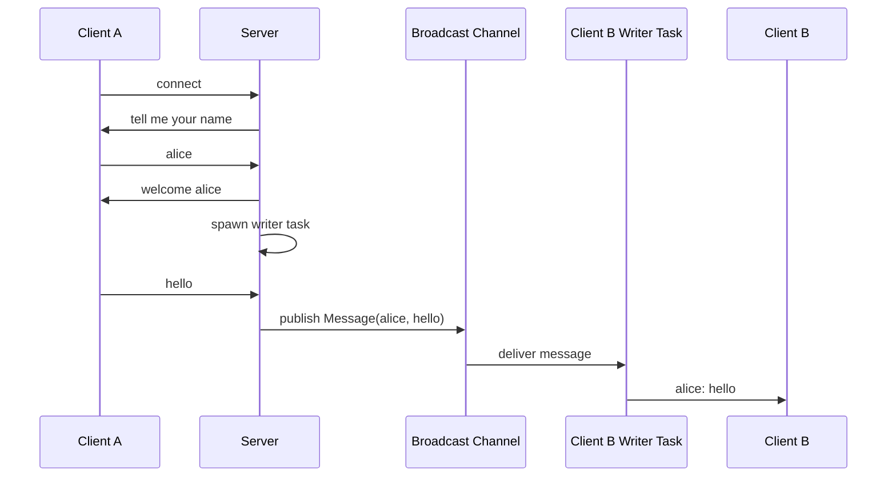

# async-chat-server

A small async TCP chat server written in Rust with Tokio.

This is a study project focused on async Rust, TCP I/O, Tokio tasks, and
channel-based message fanout.

The server accepts multiple TCP clients, asks each client for a name, then
broadcasts each line of chat input to the other connected clients.

## Requirements

- Rust
- Cargo

## Run

```sh
cargo run
```

By default, the server listens on:

```text
127.0.0.1:8080
```

Pass a positional address argument to bind somewhere else:

```sh
cargo run -- 0.0.0.0:8080
```

## Connect

Open two or more terminal sessions and connect with `nc`:

```sh
nc 127.0.0.1 8080
```

Each client will be prompted for a name:

```text
tell me your name
```

After entering a name, type messages and press Enter. Messages are sent to
other connected clients in this format:

```text
alice: hello
```

The sender does not receive their own messages back.

## Tests

Run the unit tests:

```sh
cargo test
```

Run formatting and lint checks:

```sh
cargo fmt --check
cargo clippy -- -D warnings
```

The current tests cover the domain and protocol helper logic:

- name trimming
- message construction
- bind address argument parsing
- name prompt handling
- propagation of input lines into broadcast messages
- filtering out messages from the same client

## Design Notes

The code is intentionally small and kept in `src/main.rs` for now.

Important internal boundaries:

- `Name` owns client-name normalization.
- `Message` represents a chat message from one named client.
- `ask_name` handles the initial name prompt.
- `propagate_messages` reads client input and publishes messages.
- `write_messages` receives broadcast messages and writes them to a client.
- `handle` wires one TCP connection into the chat flow.

Tokio's broadcast channel is used as the in-process message bus between
connected clients.

### Message Flow



## Current Limitations

- There is no graceful shutdown handling.
- Client names are not checked for uniqueness.
- Empty names and empty messages are currently allowed.
- There is no persistence, authentication, or transport security.
- Full TCP integration behavior is not covered by tests yet.
