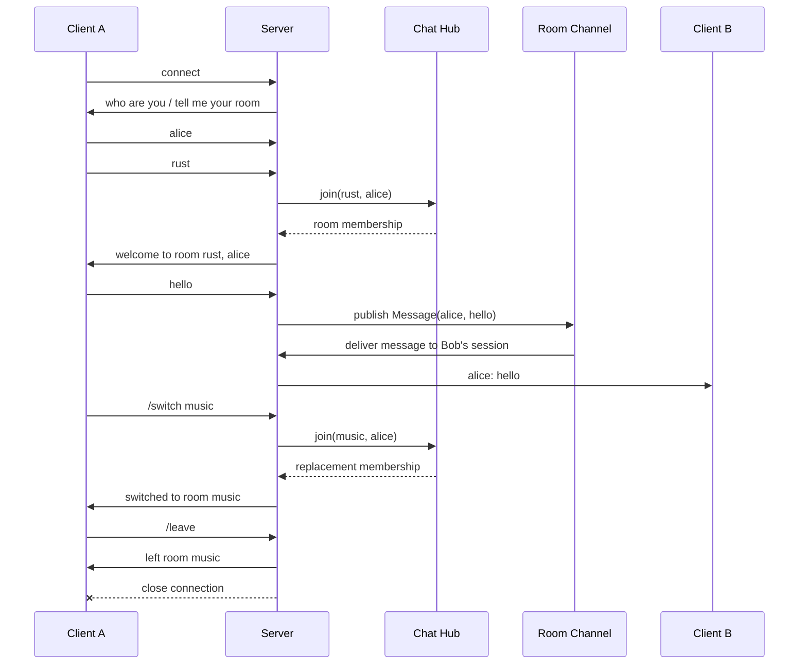

# async-chat-server

A small async TCP chat server written in Rust with Tokio.

This is a study project focused on async Rust, TCP I/O, Tokio tasks, and
channel-based message fanout.

The server accepts multiple TCP clients, asks each client for a name and room,
then broadcasts each line of chat input to the other clients in that room.

## Requirements

- Rust
- Cargo

## Run

```sh
cargo run
```

By default, the server listens on:

```text
127.0.0.1:8080
```

Pass a positional address argument to bind somewhere else:

```sh
cargo run -- 0.0.0.0:8080
```

## Connect

Open two or more terminal sessions and connect with `nc`:

```sh
nc 127.0.0.1 8080
```

Each client will be prompted for a name and room:

```text
who are you?
tell me your room
```

After entering a name and room, type messages and press Enter. Messages are sent to
other connected clients in this format:

```text
alice: hello
```

The sender does not receive their own messages back, and clients in other rooms
do not receive the message.

### Session Commands

Commands begin with `/` and are not broadcast as chat messages:

```text
/switch <room>
/leave
```

`/switch <room>` atomically replaces the current room membership while keeping
the same client name and TCP connection. The server replies with
`switched to room <room>`, or `already in room <room>` when no change is needed.

`/leave` replies with `left room <room>` and closes that client's connection.
Invalid commands and empty input receive `error: invalid input` without ending
the session.

## Manual Test

Start the server in one terminal:

```sh
cargo run
```

In three other terminals, connect with `nc 127.0.0.1 8080` and join as:

| Client | Room |
|--------|------|
| alice  | rust |
| bob    | rust |
| carol  | music |

Send a message from Alice and verify that:

- Bob receives `alice: <message>`.
- Alice does not receive her own message.
- Carol receives nothing.

Then have Alice enter `/switch music`. Verify that Alice receives the switch
acknowledgement, no longer receives messages from `rust`, and can exchange
messages with Carol in `music`. Enter `/switch music` again to verify the
same-room acknowledgement.

Enter `/leave` to verify that the server acknowledges the current room and
closes that client connection. Use `Ctrl+C` to stop the server.

## Tests

Run the unit tests:

```sh
cargo test
```

Run formatting and lint checks:

```sh
cargo fmt --check
cargo clippy -- -D warnings
```

The current tests cover the domain and protocol helper logic:

- name trimming
- message construction
- room inbox filtering and lag recovery
- bind address argument parsing
- connection prompt handling
- clean disconnects during connection prompts and active sessions
- session command parsing and invalid input handling
- room switching, same-room no-ops, and old/new room isolation
- leave acknowledgement and connection termination
- message publishing and formatted output

## Design Notes

The TCP application lives in `src/main.rs`; reusable chat behavior lives in the
library modules under `src/`.

Important internal boundaries:

- `Client` owns client-name normalization.
- `Message` represents a chat message from one named client.
- `RoomName` identifies a room.
- `ChatHub` owns the shared room registry.
- `RoomMembership` splits a joined client into publishing and receiving capabilities.
- `RoomPublisher` publishes messages to one room.
- `RoomInbox` receives messages from one room and owns lag recovery and sender filtering.
- `ask` handles connection prompts.
- `ClientInput` distinguishes chat messages from switch and leave commands.
- `JoinedRoom` owns one client's complete membership and replaces it atomically when switching.
- `run_session` selects between client input and room messages in one task.
- `handle` wires one TCP connection into the chat flow.

Each room owns a Tokio broadcast channel. Channel behavior is encapsulated by
the room publisher and inbox rather than exposed to connection handling.
Each room currently buffers up to 16 pending messages per receiver. If a
receiver falls behind that bounded buffer, older messages may be skipped for
that receiver.

### Message Flow



## Current Limitations

- There is no graceful shutdown handling.
- Client names are not checked for uniqueness.
- Empty names are currently allowed; empty chat input is rejected.
- There is no persistence, authentication, or transport security.
- Full TCP integration behavior is not covered by tests yet.
- Empty rooms are retained for the lifetime of the server.
